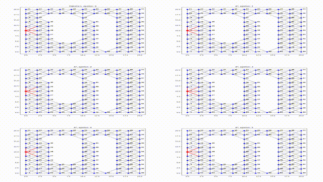

# A_Star-Path-Finding-Simulation

This project implements the A* (A-star) algorithm for pathfinding on a graph. The algorithm is tested with different heuristic values (epsilon) to analyze how it impacts the pathfinding process. The code also outputs results to a text file for easy analysis.

Overview of the Code

1. Input Files

	•	input.txt: Contains graph details.
	•	The first two lines specify the start and goal nodes.
	•	The remaining lines represent adjacency information between nodes.
	•	coords.txt: Contains the coordinates of the nodes used for calculating the heuristic.

2. Reading and Parsing Input Files

	•	The input files are read, and the data is parsed to extract the adjacency list and coordinates for each node.
	•	The adjacency list is transformed into a dictionary map_graph for easy lookup of neighbors and edge weights.
	•	The coords.txt file is read to get the coordinates of each node, which are used to calculate Euclidean distance as the heuristic function.

3. Data Structures

	•	Graph Representation: The graph is represented as a dictionary where each key is a node, and the value is a list of tuples representing neighboring nodes and edge weights.
	•	Coordinate Dictionary: coords_dict maps node indices to their respective (x, y) coordinates for heuristic calculations.

4. Heuristic Function

The heuristic function calculates the Euclidean distance between the current node and the goal, multiplied by an epsilon factor to adjust the impact of the heuristic:

def heuristic(node, goal, e):
    return e * (((coords_dict[node][0] - coords_dict[goal][0])**2 + (coords_dict[node][1] - coords_dict[goal][1])**2)**0.5)

5. A Algorithm Implementation*

The A* algorithm is implemented in the a_star function:

	•	Inputs: start, goal, graph, and an optional epsilon parameter to adjust the heuristic.
	•	Outputs:
	•	minimum_cost_res: A list of the minimum costs at each step along the shortest path.
	•	path_shortest: The shortest path from the start to the goal.
	•	visited_nodes: The order of nodes visited during the search.
	•	visited_edges: The edges explored during the search.
	•	The algorithm calculates the cost and heuristic estimates to determine the best path, updating costs and paths accordingly.

6. Running A Algorithm with Different Epsilon Values*

The algorithm is executed with epsilon values ranging from 0 to 5, and the results (shortest paths and minimum costs) are stored in output.txt.

7. Output

	•	The results are written to output.txt, where each section contains:
	•	The shortest path as a sequence of nodes.
	•	The minimum cost values for each node in the path.

Dependencies

	•	matplotlib: Used for animation (though the animation part is not fully implemented in this snippet).
	•	Standard Python libraries: os

How to Run

	1.	Place input.txt and coords.txt in the same directory as the script.
	2.	Run the script in a Python environment

File Structure

	•	input.txt: Contains graph and adjacency information.
	•	coords.txt: Node coordinates for heuristic calculations.
	•	output.txt: Output file with shortest paths and minimum costs for different epsilon values.
	•	A_star.py: Python script implementing the A* algorithm.

Notes

	•	Adjusting the epsilon parameter changes the heuristic’s influence on the pathfinding algorithm. A higher epsilon may lead to a more greedy search, while an epsilon of 0 results in Dijkstra’s algorithm.

